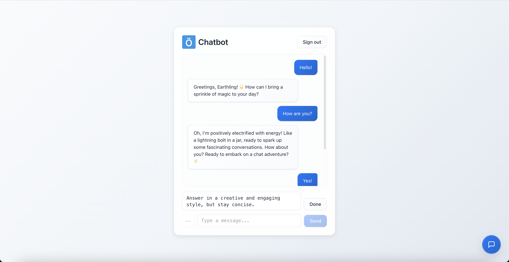

# AI Chatbot

## Description

AI Chatbot is a full-stack conversational platform built with **Node.js**, **Express**, and **MongoDB** on the backend, and **Angular** on the frontend.

The platform integrates a **chatbot interface** that communicates with an external **n8n-based OpenAI API service**, enabling **real-time streaming responses** for dynamic and interactive conversations.  
This allows users to engage with **AI-powered assistants** that deliver instant, context-aware answers tailored to their queries.

In addition, the application provides a **secure authentication system** where users can register, log in, and manage their sessions through **JWT-based access tokens** and **session tracking**.

With its **modern and responsive user interface**, **AI Chatbot** delivers a seamless chat experience through both a **full-page dashboard** and a **floating chatbot widget**, unifying user interaction and intelligent assistance within a single professional platform.

## Features

- **Authentication**: Secure registration and login with JWT access tokens and session management  
- **Session Tracking**: Token-based session validation with automatic expiration and revocation support  
- **User Management**: Full user profile support with first name, last name, and email  
- **Chat Interface**: Real-time streaming chat responses via webhook integration  
- **Dashboard View**: Full-page chat interface with message history and extra prompt options  
- **Floating Chatbot Widget**: Persistent chatbot assistant accessible from any page  
- **Message Streaming**: Server-Sent Events (SSE) for real-time AI response streaming  
- **Validation**: Comprehensive input validation for registration and login forms  
- **UI/UX**: Clean, card-based design with glassmorphism effects and smooth animations  
- **Responsive Design**: Fully optimized for desktop, tablet, and mobile devices

## Screenshots

<table>
  <tr>
    <td align="center">
      <a href="frontend/public/chatbot1.png">
        
      </a><br/><sub>Chatbot</sub>
    </td>
    <td align="center">
      <a href="frontend/public/chatbot2.png">
        
      </a><br/><sub>Chatbot in action</sub>
    </td>
  </tr>
</table>

## Installation

1. **Clone the repository**
   ```bash
   git clone https://github.com/omeroztprk/chatbot.git
   cd chatbot
   ```

2. **Install backend dependencies**
   ```bash
   npm install
   ```

3. **Set up backend environment**
   ```bash
   cp .env.example .env
   ```
   Edit the `.env` file with your configuration:
   ```env
   PORT=3000
   MONGO_URI=mongodb://localhost:27017/chatbot
   JWT_SECRET=your_jwt_secret
   WEBHOOK_URL=your-webhook-url
   CORS_ORIGIN=http://localhost:4200
   ```

4. **Install frontend dependencies**
   ```bash
   cd frontend
   npm install
   ```

5. **Set up frontend environment**
   ```bash
   cp src/environments/environment.example.ts src/environments/environment.ts
   ```
   By default, the environment.ts file includes settings such as:
   ```ts
   export const environment = {
      production: false,
      apiUrl: 'http://localhost:3000/api'
   };
   ```

## Running the Application

**Start the backend (Express API):**
```bash
npm run dev   # development mode with nodemon
npm start     # production mode
```

The backend will be available at http://localhost:3000.

**Start the frontend (Angular app):**
```bash
cd frontend
ng serve --open
```

The frontend will be available at http://localhost:4200.

## License

This project is licensed under the MIT License - see the [LICENSE](LICENSE) file for details.